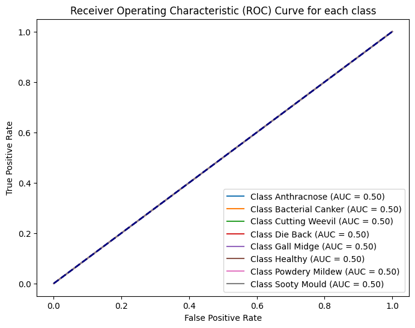

# Mango Disease Detection using ResNet50

This project demonstrates the application of deep learning in identifying various diseases in mangoes from images. The model is built using the ResNet50 architecture and is capable of predicting whether a mango is healthy or affected by one of the following diseases:

- Anthracnose
- Bacterial Canker
- Cutting Weevil
- Die Back
- Gall Midge
- Healthy
- Powdery Mildew
- Sooty Mould

## Project Structure

The project directory contains the following important files and directories:

- `dataset/`: Directory containing subfolders named after the diseases and a healthy folder. Each subfolder contains corresponding images.
- `metadata_mango.csv`: CSV file containing image paths and their respective labels.
- `mango_disease_model.h5`: Saved model file.
- `train_and_evaluate.ipynb`: Jupyter notebook containing the complete code for training and evaluating the model.

## Approach

### Data Preparation

- The dataset directory `dataset/` contains subfolders named after the diseases, and each subfolder contains images of mangoes with the corresponding disease.
- A CSV file (`metadata_mango.csv`) is generated, storing the image paths and their respective labels.

### Model Building

- The ResNet50 model is used as the base model.
- The top layers of ResNet50 are replaced with a Global Average Pooling layer, followed by a dense layer with ReLU activation and an output layer with softmax activation to classify the images into one of the 8 categories (7 diseases + healthy).

### Data Augmentation

Data augmentation techniques such as rotation, width shift, height shift, and horizontal flip are applied to the training images to enhance the model's generalization capability.

### Training

- The model is compiled with Adam optimizer, categorical cross-entropy loss, and accuracy as the metric.
- The model is trained for 20 epochs with a batch size of 32 using the augmented training data.

### Evaluation

- The model is evaluated on the test set, and metrics such as accuracy, precision, F1 score, confusion matrix, and classification report are computed.
- A few sample images from the test set are displayed along with the true and predicted labels.

## Results

The model achieved the following results on the test set:

- **Accuracy:** 94.75%
- **Precision:** 96.03%
- **F1 Score:** 94.63%

The confusion matrix and classification report provide detailed insights into the model's performance across different classes.

### Sample Output Images

Below are some sample output images showing the true and predicted labels:

## Conclusion

This project successfully demonstrates the application of a convolutional neural network using the ResNet50 architecture to classify mango images into various disease categories. The model can aid in the early detection and management of mango diseases, contributing to improved crop health and yield.
 
